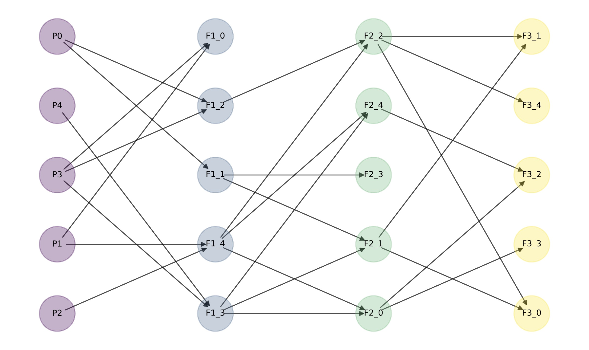

# pedigraph-sim

**Pedigree-based recombination simulation with explicit homolog tracking**

`pedigraph-sim` simulates recombination along user-defined pedigrees while explicitly tracking the ancestry of chromosome segments through time. Currently `pedigraph-sim` implements diploid inheritance and a Haldane map function. I plan to introduce additional models in future updates.

Unlike coalescent-based simulators, `pedigraph-sim` operates directly on pedigrees and produces interval-specific local genealogies (i.e. a tree sequence). 

My goal in developing `pedigraph-sim` was to bridge a gap between two approaches to modeling recombination. On one hand, there is the mechanistic process of meiosis: e.g. thinking in terms of bivalents, crossing over, and how ancestry is physically sorted over a small number of generations. On the other hand, there is the more abstract, deep-time view of the coalescent with recombination (e.g. as implemented in `msprime`).

These models can ultimately produce the same type of output (a tree sequence partitioned by historical recombination events) but the connection between them is not always intuitive... I sometimes find myself scribbling genealogy cartoons to try to relate patterns in `msprime` outputs back to the underlying generation-by-generation crossing over process.

By grounding ancestry in explicit pedigrees and mechanistic models of recombination, my hope with `pedigraph-sim` is to make this connection more transparent, making it easy to build intuition about tree sequence variation, to explore sensitivity in this variation to deviations from coalescent assumptions, and to study processes not included in more phenomenological models.

`pedigraph-sim` is designed for:

- simulating inheritance under explicit pedigrees  
- benchmarking ancestry and ARG inference methods  
- generating ground-truth local ancestry under recombination  

`pedigraph-sim` is inspired by PedigreeSim (https://github.com/PBR/pedigreeSim), and future work will prioritize incorporating the additional models featured there.

---

## Features

- Flexible diploid pedigree specification
- Explicit segment-level ancestry tracking:
  - parent homolog IDs
  - founder homolog IDs
- Multiple chromosomes
- Built-in pedigree visualization
- Reconstruction of ARG-like local ancestry graphs
- Export to Newick or `tskit`

### Priority improvements

- Additional map functions
- Ploidy variation
- Performance improvements

---

## Installation

### From PyPI (recommended):

```bash
pip install pedigraph-sim                 # core simulation
```

**Optional extras:**
```bash
pip install "pedigraph-sim[dataframe]"    # adds pandas helpers
pip install "pedigraph-sim[tskit]"        # adds tskit export
pip install "pedigraph-sim[all]"          # installs everything
```

**Extras:**
- `dataframe`: enables `.individuals_dataframe()`, `.homologs_dataframe()`, `.segments_dataframe()`
- `tskit`: enables `pg.to_tskit(...)`

### From source (latest development version)

```bash
pip install git+https://github.com/pmckenz1/pedigraph-sim.git
```

---

## Quick Start

```python
import pedigraph_sim as pg

gen_list = [
    ['P0', 'NA', 'NA'],
    ['P1', 'NA', 'NA'],
    ['P2', 'NA', 'NA'],
    ['P3', 'NA', 'NA'],
    ['P4', 'NA', 'NA'],
    ['F1_0', 'P3', 'P1'],
    ['F1_1', 'P0', 'P0'],
    ['F1_2', 'P0', 'P3'],
    ['F1_3', 'P4', 'P3'],
    ['F1_4', 'P1', 'P2'],
    ['F2_0', 'F1_4', 'F1_3'],
    ['F2_1', 'F1_1', 'F1_3'],
    ['F2_2', 'F1_2', 'F1_4'],
    ['F2_3', 'F1_1', 'F1_1'],
    ['F2_4', 'F1_3', 'F1_4'],
    ['F3_0', 'F2_1', 'F2_2'],
    ['F3_1', 'F2_1', 'F2_2'],
    ['F3_2', 'F2_0', 'F2_4'],
    ['F3_3', 'F2_0', 'F2_0'],
    ['F3_4', 'F2_2', 'F2_2'],
]

model = pg.PedigreeModel(
    pedigree=gen_list,
    chromosomes={"A": 100.0, "B": 50.0},
    seed=123,
)

model.draw_pedigree()
```



---

## Run a simulation

```python
result = model.simulate()

# inspect individuals
result
result.individuals["F3_0"]
```

**Example output:** `result.individuals["F3_0"]`

```
SimIndividual(
    individual_id='F3_0', 
    time=3, 
    homologs_by_chromosome={
        'A': [
            Homolog(
                homolog_id=60, 
                chromosome='A', 
                individual_id='F3_0', 
                time=3, 
                length=100.0, 
                segments=[
                    Segment(left=0.0, right=66.31224791052625, parent_homolog_id=45, founder_homolog_id=13), 
                    Segment(left=66.31224791052625, right=100.0, parent_homolog_id=45, founder_homolog_id=12)
                    ]
            ), 
            Homolog(
                homolog_id=61, 
                chromosome='A', 
                individual_id='F3_0', 
                time=3, 
                length=100.0, 
                segments=[
                    Segment(left=0.0, right=74.53017446460717, parent_homolog_id=49, founder_homolog_id=8), 
                    Segment(left=74.53017446460717, right=74.98318679719566, parent_homolog_id=49, founder_homolog_id=4), 
                    Segment(left=74.98318679719566, right=100.0, parent_homolog_id=49, founder_homolog_id=5)
                    ]
                )
            ], 
        'B': [
            Homolog(
                homolog_id=62, 
                chromosome='B', 
                individual_id='F3_0', 
                time=3, 
                length=50.0, 
                segments=[
                    Segment(left=0.0, right=40.93653676280072, parent_homolog_id=46, founder_homolog_id=2), 
                    Segment(left=40.93653676280072, right=50.0, parent_homolog_id=47, founder_homolog_id=14)
                    ]
                ), 
            Homolog(
                homolog_id=63, 
                chromosome='B', 
                individual_id='F3_0', 
                time=3, 
                length=50.0, 
                segments=[
                    Segment(left=0.0, right=23.757990827567365, parent_homolog_id=51, founder_homolog_id=6),
                    Segment(left=23.757990827567365, right=38.768579535484946, parent_homolog_id=51, founder_homolog_id=7), 
                    Segment(left=38.768579535484946, right=50.0, parent_homolog_id=51, founder_homolog_id=6)
                    ]
                )
            ]
        }
    )
```

For easy inspection:

```python
result.individuals_dataframe()
result.homologs_dataframe()
result.segments_dataframe()
```

---

## Local ancestry / ARG reconstruction

A central feature of `pedigraph-sim` is reconstruction of local genealogies along the chromosome.

```python
sample_hids = result.final_generation_homolog_ids("A")
seq = result.local_forests("A", sample_hids)
```

Check out local forests:

```python
for forest in seq[:3]:
    print(forest.left, forest.right)
    print("roots:", forest.roots())
    print("edges:", sorted(forest.edges))
```

---

## Export to Newick

```python
records = pg.to_newick_records(result, seq)

for rec in records[:3]:
    print(rec["left"], rec["right"])
    print(rec["newicks"])
```

Or as a dataframe:

```python
df = pg.to_dataframe(result, seq)
df.head()
```

---

## Convert to tskit

```python
ts = pg.to_tskit(result, seq)

print(ts)
print("num_trees:", ts.num_trees)
```

Inspect trees:

```python
from itertools import islice

for tree in islice(ts.trees(), 3):
    print("\ninterval:", tree.interval)
    print(tree.draw_text())
```

This makes `pedigraph-sim` compatible with the broader `tskit` ecosystem.
