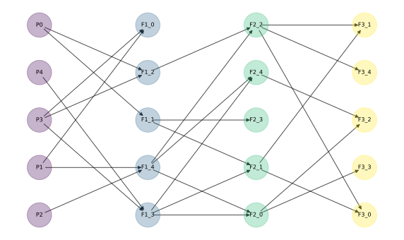

# recombigraph

**Pedigree-based recombination simulation with explicit homolog tracking**

`recombigraph` simulates recombination along user-defined pedigrees while explicitly tracking the ancestry of chromosome segments through time. It's designed for applications where inheritance structure matters, like:

- studying pedigree-based genetic processes
- benchmarking inference methods

---

## Features

- Flexible diploid pedigree specification
- Explicit tracking of:
  - parent homolog IDs
  - founder homolog IDs
- Multiple chromosomes
- Built-in pedigree visualization

### In the works:

- Top priority: ARG reconstruction
- Additional map functions
- Ploidy variation

---

## Installation

Install from PyPI:

```bash
pip install recombigraph
```

Optional extras:

```bash
pip install "recombigraph[dataframe]"
pip install "recombigraph[tskit]"
pip install "recombigraph[all]"
```
---

## Quick Start

```python
import recombigraph as rg

gen_list = [
    ['P0', 'NA', 'NA'],
    ['P1', 'NA', 'NA'],
    ['P2', 'NA', 'NA'],
    ['P3', 'NA', 'NA'],
    ['P4', 'NA', 'NA'],
    ['F1_0', 'P3', 'P1'],
    ['F1_1', 'P0', 'P0'],
    ['F1_2', 'P0', 'P3'],
    ['F1_3', 'P4', 'P3'],
    ['F1_4', 'P1', 'P2'],
    ['F2_0', 'F1_4', 'F1_3'],
    ['F2_1', 'F1_1', 'F1_3'],
    ['F2_2', 'F1_2', 'F1_4'],
    ['F2_3', 'F1_1', 'F1_1'],
    ['F2_4', 'F1_3', 'F1_4'],
    ['F3_0', 'F2_1', 'F2_2'],
    ['F3_1', 'F2_1', 'F2_2'],
    ['F3_2', 'F2_0', 'F2_4'],
    ['F3_3', 'F2_0', 'F2_0'],
    ['F3_4', 'F2_2', 'F2_2'],
]

model = rg.PedigreeModel(
    pedigree=gen_list,
    chromosomes={"A": 100.0, "B": 50.0},
    seed=123,
)

# visualize pedigree
model.draw_pedigree()
```



```python
# run simulation
result = model.simulate()

# inspect an individual
result.individuals["F3_0"]
```

`result.individuals_dataframe()`, `result.homologs_dataframe()`, and `result.segments_dataframe()` require the `dataframe` extra. `rg.to_tskit(...)` requires the `tskit` extra.


#### Example output: result.individuals["F3_0"]

```
SimIndividual(
	individual_id='F3_0', 
	time=3, 
	homologs_by_chromosome={
		'A': [
			Homolog(
				homolog_id=60, 
				chromosome='A', 
				individual_id='F3_0', 
				time=3, 
				length=100.0, 
				segments=[
					Segment(left=0.0, right=66.31224791052625, parent_homolog_id=45, founder_homolog_id=13), 
					Segment(left=66.31224791052625, right=100.0, parent_homolog_id=45, founder_homolog_id=12)
					]
			), 
			Homolog(
				homolog_id=61, 
				chromosome='A', 
				individual_id='F3_0', 
				time=3, 
				length=100.0, 
				segments=[
					Segment(left=0.0, right=74.53017446460717, parent_homolog_id=49, founder_homolog_id=8), 
					Segment(left=74.53017446460717, right=74.98318679719566, parent_homolog_id=49, founder_homolog_id=4), 
					Segment(left=74.98318679719566, right=100.0, parent_homolog_id=49, founder_homolog_id=5)
					]
				)
			], 
		'B': [
			Homolog(
				homolog_id=62, 
				chromosome='B', 
				individual_id='F3_0', 
				time=3, 
				length=50.0, 
				segments=[
					Segment(left=0.0, right=40.93653676280072, parent_homolog_id=46, founder_homolog_id=2), 
					Segment(left=40.93653676280072, right=50.0, parent_homolog_id=47, founder_homolog_id=14)
					]
				), 
			Homolog(
				homolog_id=63, 
				chromosome='B', 
				individual_id='F3_0', 
				time=3, 
				length=50.0, 
				segments=[
					Segment(left=0.0, right=23.757990827567365, parent_homolog_id=51, founder_homolog_id=6),
					Segment(left=23.757990827567365, right=38.768579535484946, parent_homolog_id=51, founder_homolog_id=7), 
					Segment(left=38.768579535484946, right=50.0, parent_homolog_id=51, founder_homolog_id=6)
					]
				)
			]
		}
	)
```
